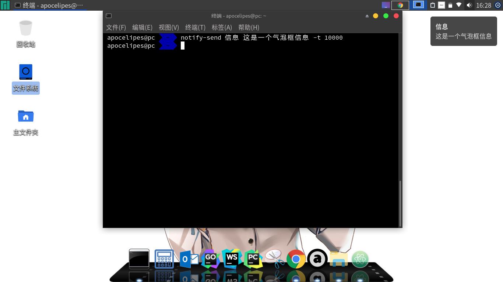
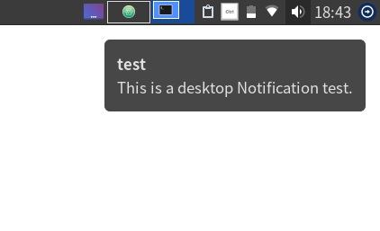
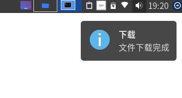

在现代Linux桌面环境上我们时常可以看到类似的消息框：



这些消息框常用在如下场景：
- 即时聊天软件的新消息
- 闹钟定时提示
- 电池电量提示
- 邮件消息
- 长耗时操作的完成提示

在freedesktop.org的规范中这种消息框被称为`Desktop Notification`，中文名我们形象得称其为“气泡框”。通过调用D-BUS服务`org.freedesktop.Notifications`提供的接口即可显示在桌面上。

所以我们先了解一下这个D-BUS服务。

## org.freedesktop.Notifications概览
一个气泡框消息通常会包含如下的属性：

| 名称 | 说明 |
| ------ | ------ |
| Application Name | 标示发送消息的程序，最好使用程序全名 |
| Replaces ID | 可选的消息ID，服务器通过id控制消息框的渲染，通常不用关注 |
| Icon | 显示在气泡框上的图标 |
| Summary | 标题，只能显示一行，叫title应该更合适 |
| Body | 消息体，支持部分HTML标签；`<b></b>`；`<i></i>`；`<u></u>`；`<a></a>`；`` |
| Actions | 显示一些按钮或者菜单（QAction），不过这一功能通常未被实现|
| Hints | 为消息体提供的额外数据，比如显示在屏幕的位置（x，y坐标）|
| Expiration Timeout | 气泡框显示的时长，单位毫秒；指定为-1时行为取决于实现；为0时气泡框将一直显示在桌面上直到用户点击 |

其中`Icon`和Hints中的`image_path`必须为本地绝对路径或者`file://`开头的文件URL。另外使用桌面环境预定义图标的名字也是可以的。

气泡框还有三个紧急程度可供选择：

| 名称 | 值 | 说明 |
| ------ | ------ | ------ |
| Low | 0 | 默认值，可以设置如何显示，应该设置一个合理的显示时间以便气泡框可以隐藏退出 |
| Normal | 1 | 同low |
| Critical | 2 | 代表重要通知，不应该自动过期隐藏 |

所有的气泡框消息请求都是异步的，通常构造请求并发送后用户就可以不再关心后续的信息，如果有特殊需要则可以自定义处理`org.freedesktop.Notifications`发送的信号。

得益于freedesktop.org的标准规范，包括KDE，GNOME，XFCE4在内的许多桌面环境都提供了对`Desktop Notification`的支持，虽然外观上可能存在一些差异但是创建气泡框的方法是一样的。

不过不用担心，我们不会直接去使用D-BUS，因为已经有简化的现成方案可供选择了。下面就让我们一起看看这些方案。

## 方案一：调用外部命令
可能你已经知道了，我要介绍的命令就是`notify-send`。

`notify-send`几乎被所有的桌面环境和发行版支持，它依赖于后面会介绍的libnotify和glib，如果你的系统上没有安装可以使用如下命令进行安装：

debian/Ubuntu:
```bash
sudo apt install libnotify-bin
```
Arch Linux:
```bash
sudo pacman -S libnotify
```

安装后可以用如下命令显示气泡框：
```bash
# notify-send title body [options]
notify-send test 'This is a desktop Notification test.' -t 10000
```
`-t`参数设置超时时间。效果如下：



具体的参数可以参考这里：[https://ss64.com/bash/notify-send.html](https://ss64.com/bash/notify-send.html)

## 方案二：通过编程方式实现
在Qt代码中调用外部命令就可以显示气泡框，然而这种方式不够灵活，所以我们需要使用前面提到的libnotify在我们的代码里生成并显示气泡框。

libnotify对各个语言都提供了binding，可以参考[这里](https://wiki.archlinux.org/index.php/Desktop_notifications#Usage_in_programming)。
这里我们选择使用golang的binding：
```golang
package main
import ("github.com/mqu/go-notify")

func main() {
	notify.Init("Hello world")
	hello := notify.NotificationNew("Hello World!", "This is an example notification.","dialog-information")
	hello.SetTimeout(5000)
	hello.Show()
}
```
上面的代码将会显示一个可以在桌面停留5s的气泡框：


不过如果每次都要使用一大串代码才能显示消息的话必然是低效的，而且需要换算时间至毫秒，所以我写了一个帮助函数在[notify.go](https://github.com/apocelipes/schannel-qt5/blob/master/widgets/notify.go):
```golang
// ShowNotification 显示org.freedesktop.Notifications气泡消息框
// duration == -1时使用默认delay
// duration == 0表示不设置超时，desktop notification将会一直显示
func ShowNotification(title, text, image string, delay time.Duration) {
	var notifyDelay int32
	if delay == -1 {
		notifyDelay = duration2millisecond(defaultNotifyDelay)
	} else {
		notifyDelay = duration2millisecond(delay)
		// 不合法值(包括duration不足1ms)，使用默认值进行替换
		if notifyDelay == -1 {
			notifyDelay = duration2millisecond(defaultNotifyDelay)
		}
	}

	libnotify.Init(applicationName)

	notify := libnotify.NotificationNew(title, text, image)
	if notify == nil {
		fmt.Fprintf(os.Stderr, "Unable to create a new notification\n")
		return
	}
	notify.SetTimeout(notifyDelay)

	notify.Show()
}

// duration2millisecond 将time.Duration转换成millisecond
// duration不足1ms将返回-1
func duration2millisecond(duration time.Duration) int32 {
	res := int32(duration / time.Millisecond)
	if res < 0 {
		return -1
	}

	return res
}
```
首先将时间值转换成毫秒数，如果太小或者不合法就使用默认的停留时间。applicationName是程序的完整名称。
因为气泡框消息是异步的，所以在调用了`Show()`之后函数就会返回，后续操作xwindows都会帮我们处理，所以这个函数调用之后是立刻返回的，不会阻塞Qt的gui事件循环，可以放心的使用：
```golang
// download something success
ShowNotification("下载", "文件下载完成", "dialog-information", 5*time.Second)
```


这样我们也可以轻松地在我们的Qt程序中使用气泡消息框了。

##### 参考：
[https://developer.gnome.org/notification-spec/](https://developer.gnome.org/notification-spec/)
