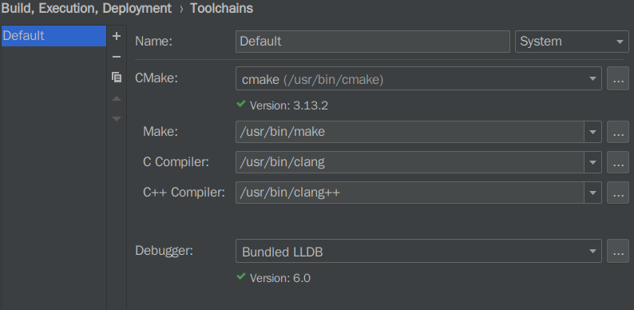
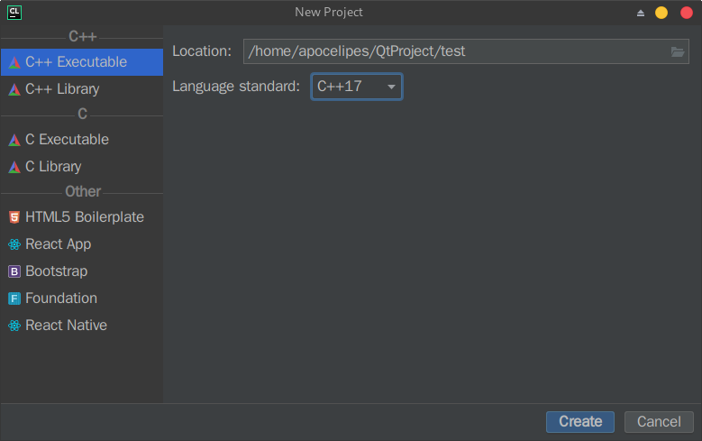
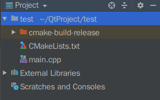
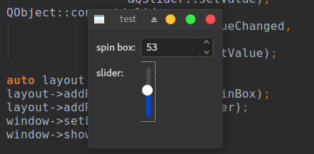

使用Qt进行程序开发时QtCreator总是不二之选。作为老牌IDE在提供了强大的功能同时也对Qt的支持做了许多优化。如果没有特别的原因你应该使用它。

然而一个顺手的工具将会极大得提升生产效率，而如果你之前使用别的工具进行开发，那么就要斟酌一下学习使用QtCreator的成本了。

所以我将介绍配置CLion（另一个强大的c++ IDE）作为Qt5的开发环境，在利用现有工具链的同时避免了安装另一个大型软件。

<h2 id="perpare">准备工作</h2>
CLion的安装和激活超出了本文的讨论范围，我们假设你已经安装好了CLion。如果需要帮助可以去CLion官网查找安装方法。

CLion默认使用GCC进行工程构建，然而使用GCC是无法使用代码补全功能的，所以我们将toolchains替换成clang：



注意，CLion自带了一个cmake，如果我们想使用系统提供的一些cmake模块，那么就必须如图所示替换为系统的cmake。

随后确保你的编译器至少要支持c++11，如果能支持c++14或者c++17那自然是最好。

<h2 id="create-project">创建Qt5项目</h2>
下面是创建Qt5项目，CLion没有区分普通c++项目和Qt项目（毕竟Qt项目一般也是c++项目或者c++/QML项目），所以这样创建即可：



创建完成后项目结构如图所示：



`cmake-build-release`目录是生成moc等工具的中间代码以及可执行文件的地方，当然可执行文件的生成路径可以自己指定，这是CLion默认的选项。

这时编译运行和代码补全还是不能用的，所以接下来我们设置编译和代码补全。

<h2 id="settings">设置Qt代码补全和项目编译</h2>
事先要说明的一点是，CLion是根据`CMakeLists.txt`文件来组织和设置项目的，所以如果我们需要添加诸如Qt这样的第三方库或是改变编译行为，都只要修改`CMakeLists.txt`即可。

所以我们需要把`CMakeLists.txt`修改成如下的样子：
```CMakeLists
cmake_minimum_required(VERSION 3.0)
project(test)

# 指定c++标准的版本
set(CMAKE_CXX_STANDARD 17)

# 自动调用moc，uic，rcc处理qt的扩展部分
set(CMAKE_AUTOMOC ON)
set(CMAKE_AUTOUIC ON)
set(CMAKE_AUTORCC ON)

set(CMAKE_INCLUDE_CURRENT_DIR ON)

# 设置Qt5的cmake模块所在目录，如果不设置将使用系统提供的版本
# QT_DIR和QT_VERSION是指定了qt安装目录和版本的环境变量
# 如果你使用了系统的cmake，那么会优先使用系统提供模块，如果不想发生这种行为你需要自己运行cmake或者使用CLion自带的
set(CMAKE_PREFIX_PATH $ENV{QT_DIR}/$ENV{QT_VERSION}/gcc_64/lib/cmake)

# 找到对应的qt模块，名字为qmake中QT += <name>中的name首字母大写后加上Qt5前缀
# 例如core为QtCore，你也可以去${CMAKE_PREFIX_PATH}的目录中找到正确的模块名
find_package(Qt5Widgets REQUIRED)

aux_source_directory(. DIRS_SRCS)

# 通常这样设置就可以，如果你的项目包含qrc文件，那么需要将它们单独添加进来
# 例如add_executable(test ${DIRS_SRCS} resources.qrc)
add_executable(test ${DIRS_SRCS})

# 把对应Qt模块的库链接进程序
target_link_libraries(test Qt5::Widgets)
```
值得注意的是，使用系统提供的Qt的一个好处是编译出来的程序可以使用系统的样式和主题，但缺点是版本可能会与我们想使用的不一致从而产生错误。

修改之后点击图中的`Reload changes`：


CLion会自动生成新的Makefile用于编译项目，现在代码补全也可以使用了。

<h2 id="compile">编译项目</h2>
我们先写一个小的示例，让一个spinbox和slider可以相互联动：
```c++
#include <QApplication>
#include <QFormLayout>
#include <QtGlobal>
#include <QObject>
#include <QSlider>
#include <QSpinBox>
#include <QWidget>

int main(int argc, char *argv[])
{
    QApplication app(argc, argv);

    auto window = new QWidget;

    auto spinBox = new QSpinBox;
    spinBox->setRange(0, 100);
    auto slider = new QSlider;
    slider->setRange(0, 100);
    QObject::connect(spinBox,
                     // 对于重载函数需要给出确定的版本，QOverload需要编译器支持c++11
                     QOverload<int>::of(&QSpinBox::valueChanged),
                     slider,
                     &QSlider::setValue);
    QObject::connect(slider,
                     &QSlider::valueChanged,
                     spinBox,
                     &QSpinBox::setValue);

    auto layout = new QFormLayout;
    layout->addRow("spin box:", spinBox);
    layout->addRow("slider:", slider);
    window->setLayout(layout);
    window->show();

    return app.exec();
}
```

然后我们点击`int main(...)`左侧的运行按钮：


程序就开始编译了：


如果编译成功程序就会自动运行：



至此CLion已经可以正常配合Qt进行开发。
