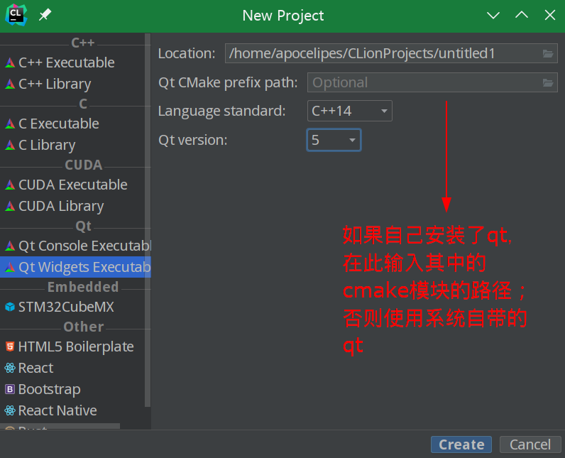
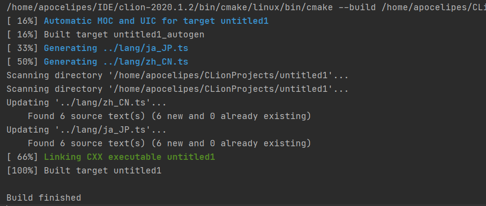
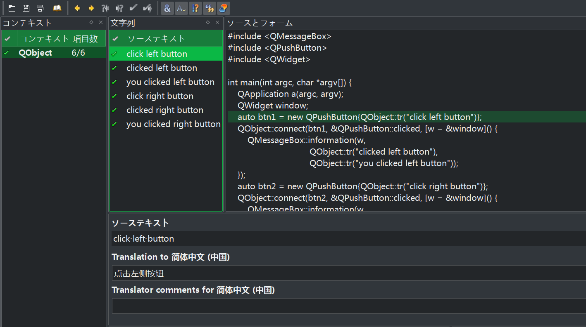
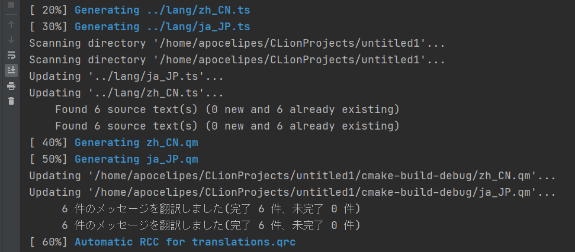
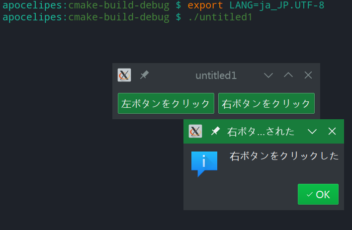
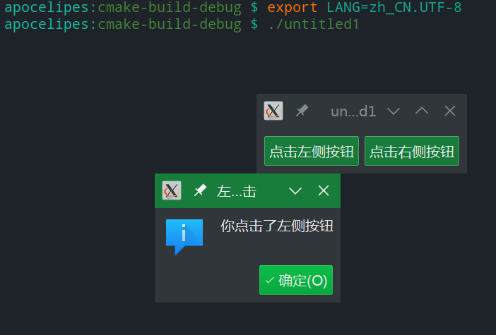

随着Qt 6的发布，cmake也正式宣告接管qmake的工作了。

在之前的一篇[博客](https://www.cnblogs.com/apocelipes/p/10353698.html)里我介绍了如何使用cmake管理你的qt项目，不过有一点我没有讲，那就是对国际化（i18n）的处理。

今天我们就来介绍下如何使用cmake+clion配置管理一个包含了国际化支持的项目。

## 准备工作

你需要准备下面的工具

1. Qt 5.13+（我使用的是Qt 5.15.2）
2. CLion 2020.3+
3. GCC 9.0+ (最好支持c++17，最低要求是支持c++11)

其中GCC一般自己安装的Qt会有附带，否则在Windows上使用vs2019的编译器也是可以的。

在Linux上如果不想自己下载安装Qt的话也可以使用系统仓库打包好的：

```bash
# ubuntu
sudo apt-get install build-essential libglu1-mesa-dev libpulse-dev libglib2.0-dev
sudo apt-get --no-install-recommends install libqt*5-dev qt*5-dev qml-module-qtquick-* qt*5-doc-html

# Arch/Manjato
sudo pacman -S base-devel
sudo pacman -S --needed qt5
```

选择CLion的2020.3及以上版本是因为它提供了自带的Qt项目模板，省去了我们自己搭框架的麻烦。

当然如果你还在使用旧版CLion的话可以参考[这篇文章](https://www.cnblogs.com/apocelipes/p/10353698.html)配置Qt项目。

Qt 6在cmake的配置上是类似的，只需要修改几个函数的名称即可，后面会提及。

## 创建项目

前置工作完成之后就可以创建项目了，如下图所示：



默认是c++14标准，我个人更喜欢用c++17，不过今天的例子使用c++14也是可以的。

创建完成后你会得到如下的CMakeLists.txt文件：

```cmake
cmake_minimum_required(VERSION 3.17)
project(untitled1)

set(CMAKE_CXX_STANDARD 17)
set(CMAKE_AUTOMOC ON)
set(CMAKE_AUTORCC ON)
set(CMAKE_AUTOUIC ON)

set(QT_VERSION 5)

# 设置需要用到的Qt modules
set(REQUIRED_LIBS Core Gui Widgets)
set(REQUIRED_LIBS_QUALIFIED Qt5::Core Qt5::Gui Qt5::Widgets)

add_executable(${PROJECT_NAME} main.cpp)

# 提示你应该指定qt的cmake模块的路径，使用系统默认配置时无需关心
# 嫌这个警告啰嗦的话完全可以注释掉或者删除
if (NOT CMAKE_PREFIX_PATH)
    message(WARNING "CMAKE_PREFIX_PATH is not defined, you may need to set it "
            "(-DCMAKE_PREFIX_PATH=\"path/to/Qt/lib/cmake\" or -DCMAKE_PREFIX_PATH=/usr/include/{host}/qt{version}/ on Ubuntu)")
endif ()

# 引入并链接用到的Qt modules
find_package(Qt${QT_VERSION} COMPONENTS ${REQUIRED_LIBS} REQUIRED)
target_link_libraries(${PROJECT_NAME} ${REQUIRED_LIBS_QUALIFIED})
```

CLion就是靠cmake来组织项目的，对于cmake的配置自然是必不可少的。

项目下还有一个提前写入了Hello World示例的`main.cpp`。点击编译运行你就会看到程序创建的窗口了。

下面我们就该进入正题了。

## 配置国际化支持

为了能更好地展示国际化，我们需要把例子代码改成下面这样：

```c++
#include <QApplication>
#include <QHBoxLayout>
#include <QMessageBox>
#include <QPushButton>
#include <QWidget>

int main(int argc, char *argv[]) {
    QApplication a(argc, argv);
    QWidget window;
    auto btn1 = new QPushButton{QObject::tr("click left button")};
    QObject::connect(btn1, &QPushButton::clicked, [w = &window]() {
        QMessageBox::information(w, 
                                 QObject::tr("clicked left button"), 
                                 QObject::tr("you clicked left button"));
    });
    auto btn2 = new QPushButton{QObject::tr("click right button")};
    QObject::connect(btn2, &QPushButton::clicked, [w = &window]() {
        QMessageBox::information(w,
                                 QObject::tr("clicked right button"),
                                 QObject::tr("you clicked right button"));
    });
    auto mainLayout = new QHBoxLayout;
    mainLayout->addWidget(btn1);
    mainLayout->addWidget(btn2);
    window.setLayout(mainLayout);
    window.show();
    return QApplication::exec();
}
```

对于国际化的细节我们不过多介绍，这里只要知道需要翻译的文字要用`QObject::tr`处理即可。

点击运行，你会看到界面上都是英文，因为现在我们还没添加国际化支持：


Qt的翻译文件由ts文件和qm文件组成，ts文件用于人类进行翻译工作，而Qt会根据ts文件生成qm文件，这是供程序使用的二进制文件，人类无法直接阅读。

所以在项目中我们只需要关心ts文件即可，下面我们创建一个lang子目录，我们要在其中进行英语到汉语和日语的翻译工作：

```bash
mkdir lang
```

不过我们不用自己创建ts文件，因为这是Qt能自动完成的。

下面我们修改一下cmake，让他能支持国际化：

```cmake
cmake_minimum_required(VERSION 3.17)
project(untitled1)

set(CMAKE_CXX_STANDARD 17)
set(CMAKE_AUTOMOC ON)
set(CMAKE_AUTORCC ON)
set(CMAKE_AUTOUIC ON)

set(QT_VERSION 5)
set(REQUIRED_LIBS Core Gui Widgets)
set(REQUIRED_LIBS_QUALIFIED Qt5::Core Qt5::Gui Qt5::Widgets)

set(TS_FILES
        ${CMAKE_SOURCE_DIR}/lang/zh_CN.ts
        ${CMAKE_SOURCE_DIR}/lang/ja_JP.ts)

find_package(Qt${QT_VERSION} COMPONENTS ${REQUIRED_LIBS} LinguistTools REQUIRED)

qt5_create_translation(QM_FILES ${CMAKE_CURRENT_SOURCE_DIR} ${TS_FILES})

add_executable(${PROJECT_NAME} main.cpp ${TS_FILES})

if (NOT CMAKE_PREFIX_PATH)
    message(WARNING "CMAKE_PREFIX_PATH is not defined, you may need to set it "
            "(-DCMAKE_PREFIX_PATH=\"path/to/Qt/lib/cmake\" or -DCMAKE_PREFIX_PATH=/usr/include/{host}/qt{version}/ on Ubuntu)")
endif ()

target_link_libraries(${PROJECT_NAME} ${REQUIRED_LIBS_QUALIFIED})
```

哇，配置变得更长更吓人了，其实核心内容一共只有这几行：

```cmake
set(TS_FILES
        ${CMAKE_SOURCE_DIR}/lang/zh_CN.ts
        ${CMAKE_SOURCE_DIR}/lang/ja_JP.ts)

find_package(Qt${QT_VERSION} COMPONENTS ${REQUIRED_LIBS} LinguistTools REQUIRED)

qt5_create_translation(QM_FILES ${CMAKE_CURRENT_SOURCE_DIR} ${TS_FILES})

add_executable(${PROJECT_NAME} main.cpp ${TS_FILES} ${QM_FILES})
```

第一行很好理解，把我们的需要的ts文件的名字先设置到变量里。

接着我们引入`Qt5::LinguistTools`，这不是c++库，只是一个帮助生成ts文件和qm文件的cmake模块，所以不能链接到程序里。

最后一行也很简单，把ts文件加入编译程序的依赖项目里，一旦发生改变就重新构建我们的程序。

关键在于`qt5_create_translation`这里，这个函数会帮我们创建ts文件，如果ts文件已经存在就会更新ts文件把新添加的翻译追加进去；

到这步还没结束，在更新完ts文件后它会检查ts文件中是否有有效的翻译信息，如果有就在cmake的编译目录下生成和ts文件同名的qm文件。

中间的`${CMAKE_CURRENT_SOURCE_DIR}`就是指定从哪个目录下的源文件里获得需要翻译的文本的。

注意，如果qm文件最终没被用到的话，那么实际上不会被生成。为了能生成qm文件所以我们把它加入了依赖，还有更好的办法，后面介绍。

在Qt 6中我们只需要把函数名改成`qt_create_translation`就行了。

如果你想自己创建和更新ts文件，只需要把函数换成`qt5_add_translation`，它会自动根据ts文件生成qm文件，不过要是没有ts文件存在他就会报错。在Qt 6中它的名字会变为`qt_add_translation`。

上述的工作会在make的时候进行，比如这样：



## 添加翻译

添加翻译没什么好讲的，你可以直接编辑ts文件，因为它是xml格式的，编辑起来还是很容易的。

不过有时候翻译需要参考文本和代码的上下文，这时候就需要用到Qt Linguist了：



具体的使用细节不再赘述，你可以参考园内和网上的其他优质文章。

编译运行后你就会在构建目录看到两个qm文件，这时候我们的程序还没有完成国际化支持，在代码中我们需要使用这些qm文件：

```c++
#include <QLocale>
#include <QTranslator>

int main()
{
    QApplication a(argc, argv);
    QTranslator trans;
    if (trans.load("./" + QLocale().name() + ".qm")) {
        QCoreApplication::installTranslator(&trans);
    }
    ...
    return a.exec();
}
```

我们用`QTranslator`加载本地的qm文件，`QLocale`的name方法正好可以返回诸如“ja_JP”的名字。

我的系统默认设置是日语，因此运行程序会看到这样的界面：


如果你的环境是中文的，那么显示的界面也是中文的，这就是Qt的i18n国际化支持。

## 将多语言资源绑定进程序

到上一节结束我们其实就把i18n讲完了，你完全可以打包程序的时候把qm文件和程序放在一起，安装的时候也放在同一目录。

但这种方案还是有些缺点的：

1. 如果支持的语言比较多，那么就会有大量的小文件需要处理，难免会出错；
2. 需要把qm这种无关的文件放进编译依赖里
   
对于有代码洁癖的我来说第二点尤其忍不了，但是如果不用这些qm文件的话最终是不会生成他们的，怎么办呢？

其实还有办法，我们可以把这些qm文件都集成到qrc里。

首先在目录下创建一个`translations.qrc`文件：

```xml
<RCC>
    <qresource>
        <file>zh_CN.qm</file>
        <file>ja_JP.qm</file>
    </qresource>
</RCC>
```

这里不用管资源文件的路径，因为我们还要对CMakeLists.txt做些修改处理这些问题：

```cmake
set(CMAKE_AUTORCC ON) # 一定得开启rcc

# 注意这行
configure_file(translations.qrc ${CMAKE_CURRENT_BINARY_DIR} COPYONLY)

...

add_executable(${PROJECT_NAME} main.cpp ${TS_FILES} ${CMAKE_CURRENT_BINARY_DIR}/translations.qrc)
```

需要注意的是`configure_file`那行，我们把qrc文件原样复制到了编译目录里，因为qm文件也是在那里生成的。

现在qrc会被自动处理，然后我们的qm文件作为其依赖项也能被自动生成了。

再次编译项目，这次我们就能发现qm被生成了：



因为使用了Qt的rcc把资源嵌入了程序，所以cpp代码也得做一些调整：

```diff
QTranslator trans;
-if (trans.load("./" + QLocale().name() + ".qm")) {
+if (trans.load(":/" + QLocale().name() + ".qm")) {
    QCoreApplication::installTranslator(&trans);
}
```

注意`.`变成了`：`，这代表我们指定的路径是嵌入资源的。

这样国际化支持就彻底完成了，通过修改Linux的`LANG`环境变量我们可以自由设置程序的语言，效果如下:





## 总结

现在我把完整的CMakeLists.txt贴上来作为参考，对于你自己的项目当然是要做调整的：

```cmake
cmake_minimum_required(VERSION 3.17)
project(untitled1)

set(CMAKE_CXX_STANDARD 17)
set(CMAKE_AUTOMOC ON)
set(CMAKE_AUTORCC ON)
set(CMAKE_AUTOUIC ON)

set(QT_VERSION 5)
set(REQUIRED_LIBS Core Gui Widgets)
set(REQUIRED_LIBS_QUALIFIED Qt5::Core Qt5::Gui Qt5::Widgets)

set(TS_FILES
        ${CMAKE_SOURCE_DIR}/lang/zh_CN.ts
        ${CMAKE_SOURCE_DIR}/lang/ja_JP.ts)

find_package(Qt${QT_VERSION} COMPONENTS ${REQUIRED_LIBS} LinguistTools REQUIRED)

configure_file(translations.qrc ${CMAKE_CURRENT_BINARY_DIR} COPYONLY)

qt5_create_translation(QM_FILES ${CMAKE_CURRENT_SOURCE_DIR} ${TS_FILES})

add_executable(${PROJECT_NAME} main.cpp ${TS_FILES} ${CMAKE_CURRENT_BINARY_DIR}/translations.qrc)

message(${QM_FILES})

target_link_libraries(${PROJECT_NAME} ${REQUIRED_LIBS_QUALIFIED})
```

不过这种方案也不是没有问题，那就是每次只能在编译期间更新ts文件，这点需要注意。

如果想要看更具体的项目是如何配置i18n的，我这也有一个[例子](https://github.com/apocelipes/pHashChecker)，如果不嫌弃觉得有帮助的话可以star一下。
