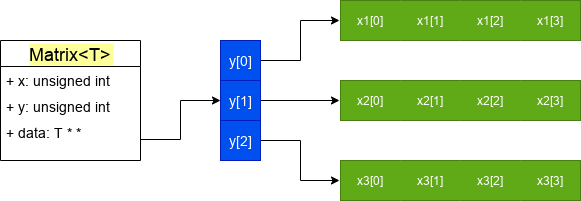
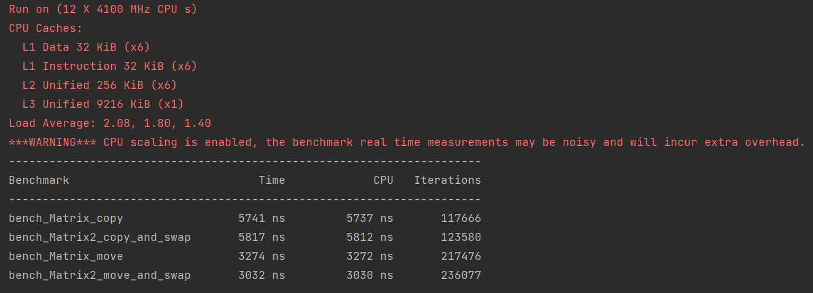

如果你对外语感兴趣，那肯定听过“idiom”这个词。牛津词典对于它的解释叫惯用语，再精简一些可以叫“成语”。想要掌握一门语言，其中的“成语”是不能不学的，而希望成为地道的语言使用者，“idiom”则是必不可少的。程序语言其实和外语也很类似，两者都有自己的语法，一个个函数也就像一个个词汇，大部分的外语都是自然语言，有着深厚的历史文化底蕴，因此有不少idiom，而编程语言虽然只有短短数十岁，idiom却不比前者少。不过对于程序设计语言的idiom来说比起文化历史的积累倒更像是工程经验指导下的最佳实践。

话说回来，我并不是在推荐你像学外语一样学c++，然而想要做个一个地道的c++程序员，常见的idiom是不可不知的。今天我们就来看看copy and swap idiom是怎么一回事。

<blockquote id="bookmark">
  <h4>本文索引</h4>
  <ul>
    <li><a href="#%E8%AE%BE%E8%AE%A1%E4%B8%80%E4%B8%AA%E4%BA%8C%E7%BB%B4%E6%95%B0%E7%BB%84">设计一个二维数组</a></li>
    <li>
      <a href="#%E8%BF%98%E7%BC%BA%E4%BA%9B%E4%BB%80%E4%B9%88">还缺些什么</a>
      <ul>
        <li><a href="#rule-of-zero">rule of zero</a></li>
        <li><a href="#%E9%BB%98%E8%AE%A4%E5%8F%AA%E8%BF%9B%E8%A1%8C%E6%B5%85%E5%A4%8D%E5%88%B6">默认只进行浅复制</a></li>
        <li><a href="#rule-of-five">rule of five</a></li>
      </ul>
    </li>
    <li>
      <a href="#copy-and-swap%E6%83%AF%E7%94%A8%E6%B3%95">copy and swap惯用法</a>
      <ul>
        <li><a href="#%E5%AE%9E%E7%8E%B0%E8%87%AA%E5%AE%9A%E4%B9%89%E5%A4%8D%E5%88%B6">实现自定义复制</a></li>
        <li><a href="#%E5%A6%82%E6%9E%9C%E5%8F%91%E7%94%9F%E4%BA%86%E5%BC%82%E5%B8%B8">如果发生了异常</a></li>
        <li><a href="#copy-and-swap">copy and swap</a></li>
        <li><a href="#%E5%AF%B9%E4%BA%8E%E7%A7%BB%E5%8A%A8%E8%B5%8B%E5%80%BC">对于移动赋值</a></li>
      </ul>
    </li>
    <li><a href="#%E6%80%A7%E8%83%BD%E5%AF%B9%E6%AF%94">性能对比</a></li>
  </ul>
</blockquote>

## 设计一个二维数组

前排提示：不要模仿这个例子，有类似的需求应该寻找第三方库或者使用容器/智能指针来实现类似的功能。

现在我们来设计一个二维数组，这个二维数组可以存任意的数据，所以我们需要泛型；我还想要能在初始化时指定数组的长度，所以我们需要一个构造函数来分配动态数组，于是我们的代码第一版是这样的：

```c++
template <typename T>
class Matrix {
public:
    Matrix(unsigned int _x, unsigned int _y)
    : x{_x}, y{_y}
    {
        data = new T*[y];
        for (auto i = 0; i < y; ++i) {
            data[i] = new T[x]{};
        }
    }

    ~Matrix() noexcept
    {
        for (auto i = 0; i < y; ++i) {
            delete [] data[i];
        }
        delete [] data;
    }

private:
    unsigned int x = 0;
    unsigned int y = 0;
    T **data = nullptr;
};
```

x是横向长高度，y是纵向长度，而在c++里想要表示这样的结构正好得把x和y对调，这样一个`x=4, y=3`的matrix看上去是下面的效果：



显而易见，我们的二维数组其实是多个单独分配的一维数组组合而成的，这也意味着他们之间的内存可能不是连续的，这也是我不推荐模仿这种实现的原因之一。

在构造函数中我们分配了内存，并且对数组使用了方括号初始化器，所以数组内如果是类类型数据则会默认初始化，如果是标量类型（int， long等）则会进行零初始化，因此不用担心我们的数组里会出现未初始化的垃圾值。

接着我们还定义了析构函数用于释放资源。

看起来一个简易的二维数组类`Matrix`定义好了。

## 还缺些什么

对，直觉可能告诉你是不是还有什么遗漏。

直觉通常是不可靠的，然而这次它却十分准，而且我们遗漏的东西不止一个！

不过在查漏补缺之前请允许我对两个早就人尽皆知的c++原则炒个冷饭。

### rule of zero

c++的类类型里有几种特殊成员函数：默认构造函数、复制构造函数、移动构造函数、析构函数、复制赋值运算符和移动赋值运算符。

如果用户没有定义（哪怕是空函数体，除非是`=default`）这些特殊成员函数，且没有其他语法定义的冲突（比如定义了任何构造函数都会导致默认构造函数不进行自动合成），那么编译器会自动合成这些特殊成员函数并用在需要它们的地方。

其中复制构造/赋值、移动构造/赋值是针对每一项类的非静态数据成员进行复制/移动。析构函数则自动调用每一项类的非静态数据成员的析构函数（如果有的话）。

看起来是很便利的功能吧，假如我的类有10个成员变量，那编译器自动合成这些函数可以省去不少烦恼了。

这就是rule of zero：如果你的类**没有自己定义任何一个除了默认构造函数外的特殊成员函数**，那么就**不应该定义任何一个复制/移动构造函数、复制/移动赋值运算符、析构函数**。

标准库的容器都定义了自己的资源管理手段，如果我们的类只使用这些标准库里的内容，或者没有自己申请分配资源（文件句柄，内存）等，则应该遵守“rule of zero”，编译器会自动为我们合成合适的函数。

### 默认只进行浅复制

如果我要在类里分配点资源呢？比如某些系统的文件句柄，共享内存什么的。

那就要当心了，比如对于我们的`Matrix`，编译器合成的复制赋值运算符是类似这样的：

```c++
template <typename T>
class Matrix {
public:
    /* ... */
    // 合成的复制赋值运算符类似下面这样
    Matrix& operator=(const Matrix& rhs)
    {
        x = rhs.x;
        y = rhs.y;
        data = rhs.data;
    }

private:
    unsigned int x = 0;
    unsigned int y = 0;
    T **data = nullptr;
};
```

问题很明显，data被浅复制了。对于指针的复制操作，默认只会复制指针本身，而不会复制指针所指向的内存。

然而即使能复制指针指向的内存，在我们这个`Matrix`里还是有问题的，因为data指向的内存里存的几个也是指针，它们分别指向别的内存区域！

这样会有什么危害呢？

两个指针指向同一个区域，而且两个指针最后都会被析构函数delete，当delete第二个指针的时候就会导致双重释放的bug；如果只删除其中一个指针，两个指针指向的内存会失效，对另一个指针指向的失效内存进行访问将会导致更著名的“释放后重用”漏洞。

这两类缺陷犹如c++er永远无法苏醒的梦魇。这也是我不推荐你模仿这个例子的又一个原因。

### rule of five

如果“rule of zero”不适用，那么就要遵循“rule of five”的建议了：如果复制类特殊成员函数、移动类特殊成员函数、析构函数**这5个函数中定义了任意一个（显式定义，不包括编译器合成和`=default`）**，那么其他的函数用户也应该**显式定义**。

有了自定义析构函数所以需要其他特殊成员函数很好理解，因为自定义析构函数通常意味着释放了一些类自己申请到的资源，因此我们需要其他函数来管理类实例被复制/移动时的行为。

而通常移动类特殊成员函数和复制类的是相互排斥的。

移动意味着所有权的转移，复制意味着所有权共享或是从当前类复制出一个一样的但是完全独立的新实例，这些对于所有权移动模型来说都是禁止的行为，因此一些类只能移动不能复制，比如`mutex`和`unique_ptr`。

而一些东西是支持复制的，但移动的意义不大，比如数组或者一块被申请的内存。

最后一种则同时支持移动和复制，通常复制产生副本是有意义的，而移动则在某些情况下帮助从临时对象那里提高性能。比如`vector`。

我们的`Matrix`恰好属于后者，移动可以提高性能，而复制出副本可以让同一个二维数组被多种算法处理。

`Matrix`本身定义了析构函数，因此根据“rule of five”应该至少实现移动类或复制类特殊成员函数中的一种，而我们的类要同时支持两种语义，自然是一个也不能落下。

## copy and swap惯用法

说了这么多也该进入正题了，篇幅有限，所以我们重点看复制类函数的实现。

### 实现自定义复制

因为浅拷贝的一系列问题，我们重新实现了正确的复制构造函数和复制赋值运算符：

```c++
// 普通构造函数
Matrix<T>::Matrix(unsigned int _x, unsigned int _y)
    : x{_x}, y{_y}
{
    data = new T*[y];
    for (auto i = 0; i < y; ++i) {
        data[i] = new T[x]{};
    }
}

Matrix<T>::Matrix(const Matrix &obj)
    : x{obj.x}, y{obj.y}
{
    data = new T*[y];
    for (auto i = 0; i < y; ++i) {
        data[i] = new T[x];
        for (auto j = 0; j < x; ++j) {
            data[i][j] = obj.data[i][j];
        }
    }
}

Matrix<T>& Matrix<T>::operator=(const Matrix &rhs)
{
    // 检测自赋值
    if (&rhs == this) {
        return *this;
    }

    // 清理旧资源，重新分配后复制新数据
    for (auto i = 0; i < y; ++i) {
        delete [] data[i];
    }
    delete [] data;
    x = rhs.x;
    y = rhs.y;
    data = new T*[y];
    for (auto i = 0; i < y; ++i) {
        data[i] = new T[x];
        for (auto j = 0; j < x; ++j) {
            data[i][j] = rhs.data[i][j];
        }
    }
    return *this;
}
```

这样做正确，但非常啰嗦。比如复制构造函数里初始化xy和分配内存的工作实际上和构造函数中的没有区别，一句老话叫“Don't repeat yourself”，所以我们可以借助c++11的新语法构造函数转发把这部分工作委托给构造函数，我们的复制构造函数只进行数组元素的复制：

```c++
Matrix<T>::Matrix(const Matrix &obj)
    : Matrix(obj.x, obj.y)
{
    for (auto i = 0; i < y; ++i) {
        for (auto j = 0; j < x; ++j) {
            data[i][j] = obj.data[i][j];
        }
    }
}
```

复制赋值运算符里也有和构造函数+析构函数重复的部分，我们能简化吗？遗憾的是我们不能在赋值运算符里转发操作给构造函数，而`delete this`后再使用构造函数也是未定义行为，因为this代指的类实例如果不是new分配的则不合法，如果是new分配的也会因为delete后对应内存空间已失效再次进行访问是“释放后重用”。那我们先调用析构函数再在同一个内存空间上构造`Matrix`呢？对于能平凡析构的类型来说，这是完全合法的，可惜的是自定义析构函数会让类无法“平凡析构”，所以我们也不能这么做。

虽说不能简化代码，但我们的类不是也能正确工作了吗，先上线再说吧。

### 如果发生了异常

看起来`Matrix`可以正常运行了，然而上线几天后程序崩溃了，因为复制赋值运算符的new语句或是某次数组元素拷贝抛出了一个异常。

你想这样什么大不了的，我早就未雨绸缪了：

```c++
try {
    Matrix<T> a{10, 10};
    Matrix<T> b{20, 20};
    // 一些操作
    a = b; 
} catch (exception &err) {
    // 打些log，然后对a和b做些善后
}
```

这段代码天衣无缝的外表下却暗藏杀机：a在复制失败后原始数据已经删除，而新数据也可能只初始化了一半，这是访问a的数据会导致多种未定义行为，其中一部分会让系统崩溃。

关键在于如何让异常发生的时候a和b都能保持有效状态，现在我们可以保证b有效，需要做到的是如何保证a能回到初始化状态或者更好的办法——让a保持赋值前的状态不变。

至于为什么不让赋值运算不抛异常，因为我们控制不了用户存入的T类型的实例会不会抛异常，所以不能进行控制。

### copy and swap

现在我们不仅没解决重复代码的问题，我们的赋值运算符几乎把析构函数和复制构造函数抄了一遍；还引入了新的问题赋值运算的异常安全性——要么赋值成功，要么别对运算的操作数产生任何影响。

该轮到“copy and swap惯用法”闪亮登场了，它可以帮我们一次解决这两个问题。

我们来看看它有什么妙招：

1. 首先我们用复制构造函数从rhs复制出一个tmp，这一步复用了复制构造函数；
2. 接着用一个保证不会发生错误的swap函数交换tmp和this的成员变量；
3. 函数返回，交换后的tmp销毁，等于复用了析构函数，旧资源也得到了正确清理。

如果复制发生错误，那么前面例子里的a不会被改变；如果tmp析构发生错误，**当然这是不可能的**，因为我们已经把析构函数声明成`noexcept`了，还要抛异常只能说明程序遇到了非常严重的错误会被系统立即中止运行。

显然，重点是swap函数，我们看看是怎么实现的：

```c++
template <typename T>
class Matrix {
    friend void swap(Matrix &a, Matrix &b) noexcept
    {
        using std::swap; // 这一步允许编译器基于ADL寻找合适的swap函数
        swap(a.x, b.x);
        swap(a.y, b.y);
        swap(a.data, b.data);
    }
};
```

通过ADL，我们可以利用`std::swap`或是某些类型针对swap实现的优化版本，而`noexcept`则保证了我们的swap不会抛出异常（简单的交换通常都基于移动语义实现，一般保证不会产生异常）。本质上swap的逻辑是很简洁明了的。

有了swap帮忙，现在我们的赋值运算符可以这么写了：

```c++
Matrix<T>& Matrix<T>::operator=(const Matrix &rhs)
{
    // 检测自赋值
    if (&rhs == this) {
        return *this;
    }

    Matrix tmp = rhs; // copy
    swap(tmp, *this); // swap
    return *this;
}
```

你甚至还可以省去自赋值检测，因为现在使用了copy and swap后自赋值*除了浪费了点性能外已经无害了*。

使用“copy and swap惯用法”不仅解决了代码复用，还保证了赋值操作的安全性，真正的一箭双雕。

### 对于移动赋值

移动赋值运算本身只是释放左操作数的数据，再移动一些已经获得的资源然后把rhs重置会安全的初始化状态，这些通常都不会产生异常，代码也很简单没有太多重复，只不过释放数据和把数据从rhs移动到lhs，这两个操作是不是有点眼熟？

对，swap写出来就是为了干这种杂活的，所以我们还能实现`move and swap`：

```c++
Matrix<T>& Matrix<T>::operator=(Matrix2 &&rhs) noexcept
{
    Matrix2 tmp{std::forward<Matrix2>(rhs)};
    swap(*this, tmp);
    return *this;
}
```

当然，正如我说的，通常没必要这么写。

## 性能对比

现在我们的`Matrix`已经可以健壮地管理自己申请的内存资源了。

然而还有最后一点疑问：我们知道copy and swap会多创建一个临时对象并多出一次交换操作，这对性能会带来多大的影响呢？

我只能说会有一点影响，但这个“一点”到底是多少不跑测试我也口说无凭。所以我基于google benchmark写了个简单测试，如果还不了解benchmark怎么用，可以看看我写的[教程](https://www.cnblogs.com/apocelipes/p/10348925.html)。 

全部的测试代码有200行，实在是太长了，所以我把它贴在了gist上，你可以在[这里](https://gist.github.com/apocelipes/2f51ac6749d0923d02f4bb752a78606)查看。

下面是在我的机器上的测试结果：



可以看到性能差异几乎可以忽略不计，因为`Matrix`只有三个简单的成员变量，自然也不会有太大的开销。

所以我的建议是：能上copy and swap的地方尽量上，除非你测试显示copy and swap带来了严重的性能瓶颈。

##### 参考

<https://stackoverflow.com/questions/3279543/what-is-the-copy-and-swap-idiom>

<https://stackoverflow.com/questions/6687388/why-do-some-people-use-swap-for-move-assignments>

<https://stackoverflow.com/questions/32234623/using-swap-to-implement-move-assignment>

<http://www.vollmann.ch/en/blog/implementing-move-assignment-variations-in-c++.html>

<https://cpppatterns.com/patterns/copy-and-swap.html>
