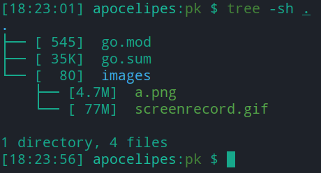
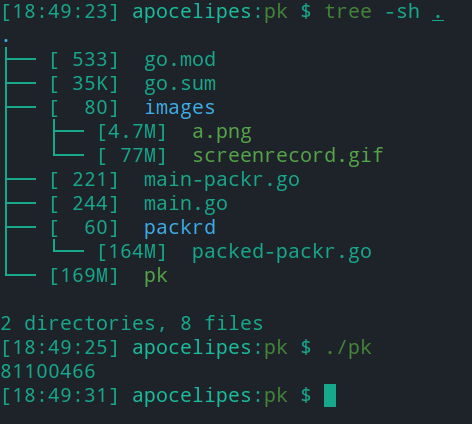

今天是万圣节，也是golang1.16新特性冻结的日子。不得不说自从go2路线发布之后golang新特性的迭代速度也飞速提升，1.16中有相当多的重要更新，包括io标准库的重构，语言内置的静态资源嵌入等。

本次将要介绍的是新的静态资源嵌入功能，虽然之前已经有相关的提案，但实际的api和提案还有些出入，今天新特性冻结也就意味着1.16的api已经趋于稳定，是时候学习新知识了。

<blockquote id="bookmark">
  <h4>本文索引</h4>
  <ul>
    <li><a href="#%E4%B8%BA%E4%BB%80%E4%B9%88%E6%88%91%E4%BB%AC%E9%9C%80%E8%A6%81%E5%B5%8C%E5%85%A5%E9%9D%99%E6%80%81%E8%B5%84%E6%BA%90">为什么我们需要嵌入静态资源</a></li>
    <li><a href="#golang116%E5%89%8D%E5%A6%82%E4%BD%95%E5%B5%8C%E5%85%A5%E9%9D%99%E6%80%81%E8%B5%84%E6%BA%90">golang1.16前如何嵌入静态资源</a></li>
    <li><a href="#%E5%87%86%E5%A4%87%E5%B7%A5%E4%BD%9C">准备工作</a></li>
    <li><a href="#%E5%A6%82%E4%BD%95%E5%8C%B9%E9%85%8D%E9%9D%99%E6%80%81%E8%B5%84%E6%BA%90">如何匹配静态资源</a></li>
    <li>
      <a href="#%E5%A6%82%E4%BD%95%E4%BD%BF%E7%94%A8%E5%B5%8C%E5%85%A5%E7%9A%84%E9%9D%99%E6%80%81%E8%B5%84%E6%BA%90">如何使用嵌入的静态资源</a>
      <ul>
        <li><a href="#%E5%A4%84%E7%90%86%E5%8D%95%E4%B8%AA%E6%96%87%E4%BB%B6">处理单个文件</a></li>
        <li><a href="#%E5%A4%84%E7%90%86%E5%A4%9A%E4%B8%AA%E6%96%87%E4%BB%B6%E5%92%8C%E7%9B%AE%E5%BD%95">处理多个文件和目录</a></li>
      </ul>
    </li>
    <li>
      <a href="#%E4%B8%80%E4%BA%9B%E9%99%B7%E9%98%B1">一些陷阱</a>
      <ul>
        <li><a href="#%E9%9A%90%E8%97%8F%E6%96%87%E4%BB%B6%E7%9A%84%E5%A4%84%E7%90%86">隐藏文件的处理</a></li>
        <li><a href="#%E8%B5%84%E6%BA%90%E6%98%AF%E5%90%A6%E5%BA%94%E8%AF%A5%E8%A2%AB%E5%8E%8B%E7%BC%A9">资源是否应该被压缩</a></li>
        <li><a href="#%E6%BD%9C%E5%9C%A8%E7%9A%84%E5%B5%8C%E5%85%A5%E8%B5%84%E6%BA%90%E5%89%AF%E6%9C%AC">潜在的嵌入资源副本</a></li>
        <li><a href="#%E8%BF%87%E5%A4%A7%E7%9A%84%E5%8F%AF%E6%89%A7%E8%A1%8C%E6%96%87%E4%BB%B6%E5%B8%A6%E6%9D%A5%E7%9A%84%E6%80%A7%E8%83%BD%E5%BD%B1%E5%93%8D">过大的可执行文件带来的性能影响</a></li>
        <li><a href="#%E4%BC%9A%E8%A2%AB%E5%BF%BD%E7%95%A5%E7%9A%84%E7%9B%AE%E5%BD%95">会被忽略的目录</a></li>
      </ul>
    </li>
    <li><a href="#%E6%80%BB%E7%BB%93">总结</a></li>
  </ul>
</blockquote>

## 为什么我们需要嵌入静态资源

先问是不是，再问为什么。

我们确实需要把静态资源嵌入在程序里，原因无外乎以下几点：

- 部署程序更简单。传统部署要么需要把静态资源和编译好的程序一起打包上传，要么使用docker和dockerfile自动化前者，心智负担较重；
- 保证程序完整性。运行中发生静态资源损坏或丢失往往会影响程序的正常运行；
- 可以自主控制程序需要的静态资源。

最常见的，比如一个静态网站的后端程序，本来需要把程序和它依赖的html模板，css，js，图片一起上传至生产服务器，同时还要正确配置静态资源在web服务器中的路径才能让用户正常访问。现在我们把这些资源全部嵌入在程序中，部署时只需要部署一个二进制文件，配置也只需要针对这个程序本身进行，部署流程被大大简化了。

另一个更常见的例子是Qt。Qt提供了qrc进行静态资源的嵌入，将图片，声音等资源嵌入在程序中，Qt程序可以更方便地在各个平台上进行分发安装，同时还能提供较为一致的用户体验。

## golang1.16前如何嵌入静态资源

在1.16之前我们需要借助工具来实现。这些工具都是借助代码生成来完成资源嵌入的，我们拿使用的最多的_packr_举例，项目链接在这里：<https://github.com/gobuffalo/packr>。

首先我们创建一个项目：

```bash
mkdir pk && cd pk
go mod init my.mod/pk
go get -u github.com/gobuffalo/packr/v2/... # 安装库
go get -u github.com/gobuffalo/packr/v2/packr2 # 安装资源打包工具
```

然后我们复制一个png图片和一个录屏软件制造的巨型gif文件进images文件夹，整个项目看起来如下：



然后是我们的代码：

```golang
package main

import (
  "fmt"

  "github.com/gobuffalo/packr/v2"
)

func main() {
  box := packr.New("myBox", "./images") // 创建内嵌资源

  data, err := box.Find("screenrecord.gif") // 查找内嵌资源
  if err != nil {
    log.Fatal(err)
  }
  fmt.Println(len(data))
}
```

想要完成资源嵌入，我们需要运行`packr2`命令，之后直接运行`go build`即可，顺利运行后项目会是这样：



packr的思路就是将资源文件编码成合法的golang源文件，然后利用golang把这些代码化的资源编译进程序里。这是比较主流的嵌入资源实现方案。

从上面的例子里我们可以看到这类方法有不少缺点：

- 需要安装额外的工具
- 会生成超大体积的生产代码（是静态资源的两倍大，因为需要对二进制数据进行一定的编码才能正常存储在go源文件里）
- 编译完成的程序体积也是资源文件的两倍多
- 程序加载时间长，上图中程序运行花费了6秒，我们程序是存放在ssd上的，慢是因为库需要对编码的资源进行处理

前两点通过语言内置工具或机制就可以得到解决，而对于后两点，静态资源本身在计算机上也是二进制存储的，重复编码解码浪费时间，如果可以直接把资源放进程序里该多好。同时告别了生成代码还可以让我们的项目结构更清晰。

所以，golang1.16的官方内置版静态资源嵌入方案诞生了。

## 准备工作

golang的embed需要在１.16及之后的版本才能运行，不过我们已经可以自行编译尝鲜了(需要电脑已经安装了稳定版本的golang)：

```bash
mkdir -p ~/go-next && cd ~/go-next
git clone https://github.com/golang/go
cd go/src && bash ./make.bash
export GOROOT=~/go-next/go
alias newgo=${GOROOT}/bin/go
```

验证一下安装：

```bash
$ newgo version

go version devel +256d729c0b Fri Oct 30 15:26:28 2020 +0000 linux/amd64
```

至此准备工作就结束了。

## 如何匹配静态资源

想要嵌入静态资源，首先我们得利用`embed`这个新的标准库。在声明静态资源的文件里我们需要引入这个库。

对于我们想要嵌入进程序的资源，需要使用`//go:embed`指令进行声明，注意`//`之后不能有空格。具体格式如下：

```text
//go:embed pattern
// pattern是path.Match所支持的路径通配符
```

具体的通配符如下，如果你是在linux系统上，可以用`man 7 glob`查看更详细的教程：

| 通配符 | 释义 |
|---|---|
| ? | 代表任意一个字符（不包括半角中括号） |
| * | 代表0至多个任意字符组成的字符串（不包括半角中括号） |
| [...]和[!...] | 代表任意一个匹配方括号里字符的字符，!表示任意不匹配方括号中字符的字符 |
| [a-z]、[0-9] | 代表匹配a-z任意一个字符的字符或是0-9中的任意一个数字 |
| ** | 部分系统支持，\*不能跨目录匹配，\*\*可以，不过目前个golang中和*是同义词 |

我们可以在embed的pattern里自由组合这些通配符。

golang的embed默认的根目录从module的目录开始，路径开头不可以带`/`，不管windows还是其他系统路径分割副一律使用`/`。如果匹配到的是目录，那么目录下的所有文件都会被嵌入（有部分文件夹和文件会被排除，后面详细介绍），如果其中包含有子目录，则对子目录进行递归嵌入。

下面举一些例子，假设我们的项目在/tmp/proj：

```text
//go:embed images
这是匹配所有位于/tmp/proj/images及其子目录中的文件

//go:embed images/jpg/a.jpg
匹配/tmp/proj/images/jpg/a.jpg这一个文件

//go:embed a.txt
匹配/tmp/proj/a.txt

//go:embed images/jpg/*.jpg
匹配/tmp/proj/images/jpg下所有.jpg文件

//go:embed images/jpg/a?.jpg
匹配/tmp/proj/images/jpg下的a1.jpg a2.jpg ab.jpg等

//go:embed images/??g/*.*
匹配/tmp/proj/images下的jpg和png文件夹里的所有有后缀名的文件，例如png/123.png jpg/a.jpeg

//go:embed *
直接匹配整个/tmp/proj

//go:embed a.txt
//go:embed *.png *.jpg
//go:embed aa.jpg
可以指定多个//go:embed指令行，之间不能有空行，也可以用空格在一行里写上对个模式匹配，表示匹配所有这些文件，相当于并集操作
可以包含重复的文件或是模式串，golang对于相同的文件只会嵌入一次，很智能
```

另外，通配符的默认目录和源文件所在的目录是同一目录，所以我们只能匹配同目录下的文件或目录，不能匹配到父目录。举个例子：

```bash
.
├── code
│   └── main.go
├── go.mod
├── imgs
│   ├── jpg
│   │   ├── a.jpg
│   │   ├── b.jpg
│   │   └── c.jpg
│   ├── png
│   │   ├── a.png
│   │   ├── b.png
│   │   └── c.png
│   └── screenrecord.gif
└── texts
    ├── en.txt
    ├── jp.txt
    └── zh.txt

5 directories, 12 files
```

考虑如上的目录结构。

在这里的`main.go`可见的资源只有`code`目录及其子目录里的文件，而`imgs`和`texts`里的文件是无法匹配到的。

## 如何使用嵌入的静态资源

在了解了如何指定需要的静态资源之后，我们该学习如何使用它们了，还记得我们前面提到的`embed`标准库吗？

对于一个完整的嵌入资源，代码中的声明是这样的：

```golang
//go:embed images
var imgs embed.FS

//go:embed a.txt
var txt []byte

//go:embed b.txt
var txt2 string
```

一共有三种数据格式可选：

| 数据类型 | 说明 |
| --- | --- |
| []byte | 表示数据存储为二进制格式，如果只使用[]byte和string需要以`import (_ "embed")`的形式引入embed标准库 |
| string | 表示数据被编码成utf8编码的字符串，因此不要用这个格式嵌入二进制文件比如图片，引入embed的规则同[]byte |
| embed.FS | 表示存储多个文件和目录的结构，[]byte和string只能存储单个文件 |

下面看个具体例子，目录结构如下：

```bash
$ tree -sh .

.
├── [ 487]  embed_fs.go
├── [ 235]  embed_img.go
├── [ 187]  embed_img2.go
├── [ 513]  embed_img_fs.go
├── [ 211]  embed_text.go
├── [ 660]  embed_text_fs.go
├── [  30]  go.mod
├── [   0]  imgs
│   ├── [   0]  jpg
│   │   ├── [606K]  a.jpg
│   │   ├── [976K]  b.jpg
│   │   └── [342K]  c.jpg
│   ├── [   0]  png
│   │   ├── [4.7M]  a.png
│   │   ├── [1.4M]  b.png
│   │   └── [1.7M]  c.png
│   └── [ 77M]  screenrecord.gif
├── [ 98K]  macbeth.txt
└── [   0]  texts
    ├── [  12]  en.txt
    ├── [  25]  jp.txt
    └── [  16]  zh.txt

4 directories, 18 files
```

目录包含了一些静态图片，一个录屏文件，一个莎士比亚的麦克白剧本。当然还有我们的测试代码。

### 处理单个文件

我们先来看用`[]byte`和`string`嵌入单个文件的例子：

```golang
package main

import (
    "fmt"
    _ "embed"
)

//go:embed macbeth.txt
var macbeth string

func main(){
    fmt.Println(len(macbeth)) // 麦克白的总字符数
    //go:embed texts/en.txt
    var hello string
    fmt.Println(hello) // Output: Hello, world
}
```

如你所见，嵌入内容声明可以放进任意作用域，但变量一定要求用`var`声明。直接使用`newgo run embed_txt.go`或`go build embed_txt.go && ./embed_txt`即可完成编译运行，过程中不会生成任何中间代码。另外变量是否是公开的（首字母是否大小写）并不会对资源的嵌入产生影响。

再来看看二进制文件的例子，embed_img.go如下所示：

```golang
package main

import (
    "fmt"
    _ "embed"
)

//go:embed imgs/screenrecord.gif
var gif []byte

//go:embed imgs/png/a.png
var png []byte

func main() {
    fmt.Println("gif size:", len(gif)) // gif size: 81100466
    fmt.Println("png size:", len(png)) // png size: 4958264
}
```

如果编译运行这个程序，你会发现二进制文件的大小是89M（不同系统会有差异），比我们之前使用packr创建的要小了许多。

### 处理多个文件和目录

下面就要进入本文的重头戏了，新的标准库`embed`的使用。

如果你`newgo doc embed`的话会发现整个标准库里只有一个`FS`类型（之前按提案被命名为Files，后来考虑到用目录结构组织多个资源更类似新的io/fs.FS接口，故改名），而我们对静态资源的操作也全都依赖这个`FS`。下面接着用例子说明：

```golang
package main

import (
    "fmt"
    "embed"
)

//go:embed texts
var dir embed.FS

// 两者没什么区别
//go:embed texts/*
var files embed.FS

func main(){
    zh, err := files.ReadFile("texts/zh.txt")
    if err != nil {
        fmt.Println("read zh.txt error:", err)
    } else {
        fmt.Println("zh.txt:", string(zh))
    }

    jp, err := dir.ReadFile("jp.txt")
    if err != nil {
        fmt.Println("read  jp.txt error:", err)
    } else {
        fmt.Println("jp.txt:", string(jp))
    }
    
    jp, err = dir.ReadFile("texts/jp.txt")
    if err != nil {
        fmt.Println("read  jp.txt error:", err)
    } else {
        fmt.Println("jp.txt:", string(jp))
    }
}
```

运行结果：

```text
zh.txt: 你好，世界

read  jp.txt error: open jp.txt: file does not exist
jp.txt: こんにちは、世界

```

我们想读取单个文件需要用`ReadFile`方法，它接受一个path字符串做参数，从中查找对应的文件然后返回`([]byte, error)`。

要注意的是文件路径必须要明确写出自己的父级目录，否则会报错，_因为嵌入资源是按它存储路径相同的结构存储的，和通配符怎么指定无关_。

`Open`是和ReadFile类似的方法，只不过返回了一个`fs.File`类型的`io.Reader`，因此这里就不再赘述，需要使用`Open`还是`ReadFile`可以由开发者根据自身需求决定。

`embed.FS`自身是只读的，所以我们不能在运行时添加或删除嵌入的文件，`fs.File`也是只读的，所以我们不能修改嵌入资源的内容。

如果只是提供了一个查找读取资源的能力，那未免小看了embed。在golang1.16里任意实现了`io/fs.FS`接口的类型都可以表现的像是真实存在于文件系统中的目录一样，哪怕它其实是在内存里的类map数据结构。因此我们也可以像遍历目录一样去处理`embed.FS`:

```golang
package main

import (
	"embed"
	"fmt"
)

// 更推荐直接用imgs去匹配
//go:embed imgs/**
var dir embed.FS

// 遍历当前目录，有兴趣你可以改成递归版本的
func printDir(name string) {
	// 返回[]fs.DirEntry
	entries, err := dir.ReadDir(name)
	if err != nil {
		panic(err)
	}

	fmt.Println("dir:", name)
	for _, entry := range entries {
		// fs.DirEntry的Info接口会返回fs.FileInfo，这东西被从os移动到了io/fs，接口本身没有变化
		info, _ := entry.Info()
		fmt.Println("file name:", entry.Name(), "\tisDir:", entry.IsDir(), "\tsize:", info.Size())
	}
	fmt.Println()
}

func main() {
	printDir("imgs")
	printDir("imgs/jpg")
	printDir("imgs/png")
}
```

运行结果：

```text
dir: imgs
file name: jpg  isDir: true     size: 0
file name: png  isDir: true     size: 0
file name: screenrecord.gif     isDir: false    size: 81100466

dir: imgs/jpg
file name: a.jpg        isDir: false    size: 620419
file name: b.jpg        isDir: false    size: 999162
file name: c.jpg        isDir: false    size: 349725

dir: imgs/png
file name: a.png        isDir: false    size: 4958264
file name: b.png        isDir: false    size: 1498303
file name: c.png        isDir: false    size: 1751934
```

唯一和真实的目录不一样的地方是目录文件的大小，在ext4等文件系统上目录会存储子项目的元信息，所以大小通常不为0。

如果想要内嵌整个module，则在引用的时候需要使用`"."`这个名字，但除了单独使用之外路径里不可以包含`..`或者`.`，换而言之，`embed.FS`不支持相对路径，把上面的代码稍加修改：

```golang
package main

import (
    "fmt"
    "embed"
)

//go:embed *
var dir embed.FS

func main() {
    printDir(".")
    //printDir("./texts/../imgs") panic: open ./texts/../imgs: file does not exist
}
```

程序输出：

```text
dir: .
file name: embed_fs.go  isDir: false    size: 484
file name: embed_img.go         isDir: false    size: 235
file name: embed_img2.go        isDir: false    size: 187
file name: embed_img_fs.go      isDir: false    size: 692
file name: embed_text.go        isDir: false    size: 211
file name: embed_text_fs.go     isDir: false    size: 603
file name: go.mod       isDir: false    size: 30
file name: imgs         isDir: true     size: 0
file name: macbeth.txt  isDir: false    size: 100095
file name: texts        isDir: true     size: 0
```

因为使用了错误的文件名或路径会在运行时panic，所以要格外小心。（当然`//go:embed`是在编译时检查的，而且同样不支持相对路径，同时也不支持超出了module目录的任何路径，比如go module在/tmp/proj，我们指定了/tmp/proj2）

你也可以用`embed.FS`处理单个文件，但我个人认为单个文件就没必要再多包装一层了。

由于是golang内建的支持，所以上述的代码无需调用任何第三方工具，也没有烦人的生成代码，不得不说golang对工程控制的把握上还是相当可靠的。

## 一些陷阱

方便的功能背后往往也会有陷阱相随，golang的内置静态资源嵌入也不例外。

### 隐藏文件的处理

根据2020年11月21日的[issue](https://github.com/golang/go/issues/42328)，现在golang在对目录进行递归嵌入的时候会忽略名字以下划线（_）和点（.）开头的文件或目录。这些文件名在部分文件系统中为隐藏文件，issue的提出者认为默认不应该包含这些文件，隐藏文件通常包含对程序来说没有意义的元数据，或是用户的隐私配置，除非明确声明，否则嵌入资源中包含隐藏文件是不妥的。

举个例子，假设我们有个images文件夹，底下有`a.jpg`，`.b.jpg`两个常规文件，以及`_photo_metadata`和`pngs`两个子目录，根据最新的[commit](https://github.com/golang/go/commit/37588ffcb221c12c12882b591a16243ae2799fd1)，以下的嵌入资源指令的效果如注释中的解释：

```golang
//go:embed images
var images embed.FS // 不包含.b.jpg和_photo_metadata目录

//go:embed images/*
var images embed.FS // 注意！！！ 这里包含.b.jpg和_photo_metadata目录

//go:embed images/.b.jog
var bJPG []byte // 明确给出文件名也不会被忽略
```

注意第二条。使用`*`相当于明确给出了目录下所有文件的名字，因此点和下划线开头的文件和目录也会被包含。

当然，隐藏文件不止文件名特殊这么简单，在部分文件系统上拥有正常文件名的文件通过增加某些flag或者attribute也可以变为隐藏，目前怎么处理此类情况还没有定论。官方暂且按照社区的习惯使用文件名进行区分。

另外对于`*`是否应该包含隐藏文件的争论也没有停止，官方暂且认为应该包含隐藏文件，这点要多加注意。

### 资源是否应该被压缩

静态资源嵌入的提案被接受后争论最多的就是是否应该对资源采取压缩，压缩后的资源更紧凑，不会浪费太多存储空间，特别是一些大文本文件。同时更大的程序运行加载时间越长，cpu缓存利用率可能会变低。

而反对意见认为压缩和运行时的解压一个浪费编译的时间一个浪费运行时的效率，在用户没有明确指定的情况下用户需要为自己不需要的功能花费代价。

目前官方采用的实现是不压缩嵌入资源，并预计在后续版本加入控制是否启用压缩的选项。

而真正的陷阱是接下来的内容。

### 潜在的嵌入资源副本

前文中提到过重复的匹配和相同的文件golang会自动只保留一份在变量中。没错，然而这是针对同一个变量的多个匹配说的，如果考虑下面的代码：

```golang
package main

import (
	_ "embed"
	"fmt"
)

//go:embed imgs/screenrecord.gif
var b []byte

//go:embed imgs/screenrecord.gif
var a []byte

func main() {
	fmt.Printf("a: %p %d\n", &a, len(a))
	fmt.Printf("b: %p %d\n", &b, len(b))
}
```

猜猜输出是什么：

```text
a: 0x9ff5a50 81100466
b: 0x9ff5a70 81100466
```

a和b的地址不一样！那也没关系，我们知道slice是引用类型，底层说不定引用了同一个数组呢？那再来看看文件大小：

```bash
tree -sh .
.
├── [ 484]  embed_fs.go
├── [ 230]  embed_img2.go
├── [157M]  embed_img2
├── ...
├── [   0]  imgs
│   ├ ...
│   └── [ 77M]  screenrecord.gif
├── ...

4 directories, 19 files
```

程序是资源的两倍大，这差不多就可以说明问题了，资源被复制了一份。不过从代码的角度来考虑，a和b是两个不同的对象，所以引用不同的数据也说的过去，但在开发的时候一定要小心，不要让两个资源集合出现交集，否则就要付出高昂的存储空间代价了。

### 过大的可执行文件带来的性能影响

程序文件过大会导致初次运行加载时间的增长，这是众所周知的。

然而过大的程序文件还可能会降低运行效率。程序需要利用现代的cpu快速缓存体系来提高性能，而更大的二进制文件意味着对于反复运行的热点功能cpu的快速缓存很可能会面临更多的缓存失效，因为缓存的大小有限，需要两次三次的读取和刷新才能运行完一个热点代码片段。这就是为什么几乎所有的编译器都会自行指定函数是否会被内联化而不是把这种控制权利移交给用户的原因。

然而嵌入静态文件之后究竟会对性能有多少影响呢？目前缺乏实验证据，所以没有定论。

通过修改二进制文件的一部分格式也可以让代码部分和资源部分分离从而代码在cpu看来更加紧凑，当然这么做会不会严重破坏兼容，是否真的有用也未可知。

### 会被忽略的目录

前面说过，embed会递归处理目录，出来以下的几个：

- .git
- .svn
- .bzr
- .hg

这些都是版本控制工具的目录，资源里理应不包含他们，因此是被忽略的。会被忽略的目录列在`src/cmd/go/internal/load/pkg.go`的`isBadEmbedName`函数里。

.idea不在此列，小心：P

另外不像隐藏文件可以明确指定嵌入，这些目录你是无法用任何正常手段嵌入的，golang都会忽略他们。

## 总结

使用golang1.16你可以更轻松地创建嵌入资源，不过在享受便利的同时也要注意利弊取舍，使用docker管理资源和部署也不失为一种好方法。

想要进一步测试也可以在这里下载本文的代码：<https://github.com/apocelipes/embed-example>

##### 参考

<https://go.googlesource.com/proposal/+/master/design/draft-embed.md>

<https://github.com/golang/go/commit/25d28ec55aded46e0be9c2298f24287d296a9e47>

大神的embed demo： <https://github.com/mattn/go-embed-example>
